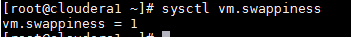
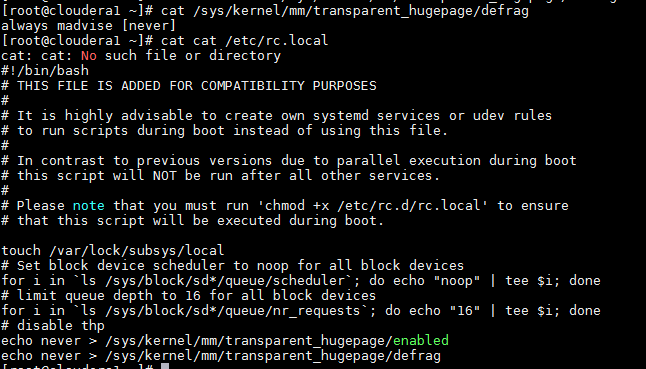
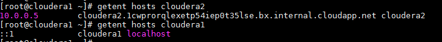

# Lab 1 pre-install configs md
```
<swappines config>
sysctl vm.swappiness=1
echo "vm.swappiness = 1" >> /etc/sysctl.conf
```
output - sysctl vm.swappines
<center>  </center>

```
<hugepages config>
echo 'never' > /sys/kernel/mm/transparent_hugepage/defrag
echo 'echo "never > /sys/kernel/mm/transparent_hugepage/defrag"' >> /etc/rc.local
echo 'echo "never > /sys/kernel/mm/transparent_hugepage/enabled"' >> /etc/rc.local

```
output - cat  /sys/kernel/mm/transparent_hugepage/defrag
output2 - cat /etc/rc.local
<center>  </center>

```
<Mount option/list>
output - cat /etc/fstab
output2 - df -h 

```
output - cat /etc/fstab
<center>  </center>

```
< Free space >
output - dumpe2fs /dev/sda2 | grep -i reserved

```
<center>  </center>

```
<Network config>
output - ifconfig -a

```
<center>  </center>

```
<host lookup>
vi /etc/hosts 
10.0.0.4 cloudera1.1cwprorqlexetp54iep0t35lse.bx.internal.cloudapp.net cloudera1
10.0.0.5 cloudera2.1cwprorqlexetp54iep0t35lse.bx.internal.cloudapp.net cloudera2
10.0.0.6 cloudera3.1cwprorqlexetp54iep0t35lse.bx.internal.cloudapp.net cloudera3
10.0.0.7 cloudera4.1cwprorqlexetp54iep0t35lse.bx.internal.cloudapp.net cloudera4
10.0.0.8 cloudera5.1cwprorqlexetp54iep0t35lse.bx.internal.cloudapp.net cloudera5

```
output - getent hosts cloudera2 | getent hosts cloudera1 
<center>  </center>

```
<nscd service>
yum install nscd
systemctl enable nscd

```
output - systemctl status nscd
<center>  </center>

```
<ntp service>
yum install ntp
systemctl enable ntpd

```
output - systemctl status ntpd 
<center>  </center>